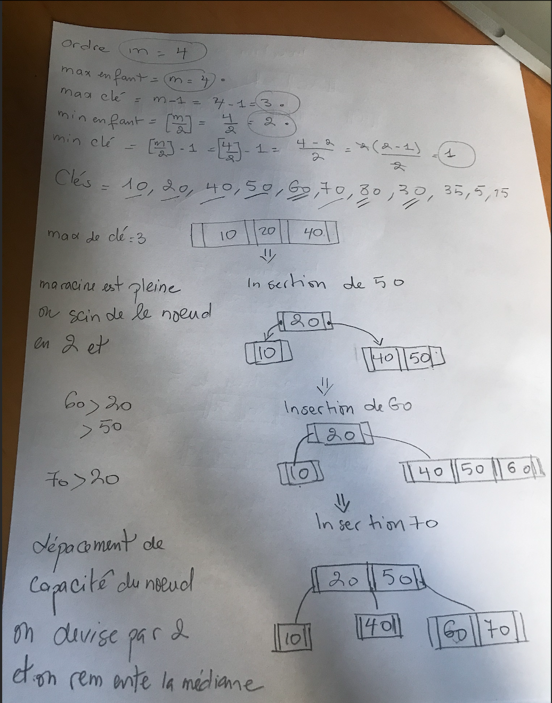
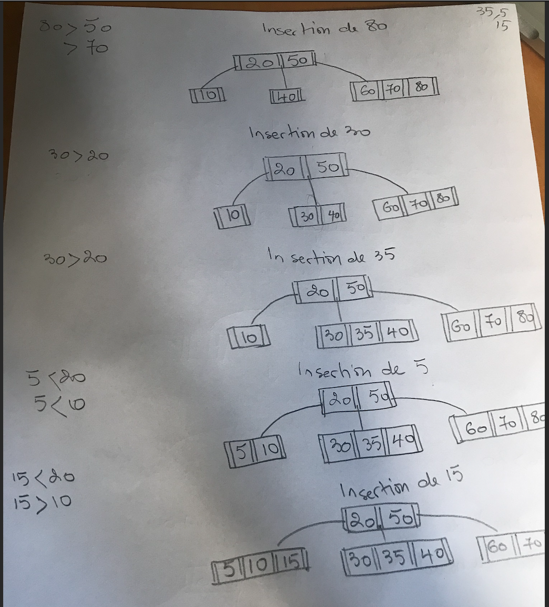

<!-- START doctoc generated TOC please keep comment here to allow auto update -->
<!-- DON'T EDIT THIS SECTION, INSTEAD RE-RUN doctoc TO UPDATE -->
**Table of Contents**  *generated with [DocToc](https://github.com/thlorenz/doctoc)*

- [Arbre B d’ordre m](#arbre-b-dordre-m)
  - [Complexité temporelle](#complexité-temporelle)
  - [Propriétés](#propriétés)
  - [Notation](#notation)
  - [Insertion](#insertion)
    - [Exemple 1 : Insertion de l’arbre B d’ordre 4](#exemple-1-insertion-de-larbre-b-dordre-4)
  - [Recherche](#recherche)
    - [Exemple Recherche de 15](#exemple-recherche-de-15)
  - [Nombre de clé dans un Arbre B d’ordre m, et de hauteur h](#nombre-de-clé-dans-un-arbre-b-dordre-m-et-de-hauteur-h)
    - [Exemple avec m = 100 et h = 2](#exemple-avec-m--100-et-h--2)

<!-- END doctoc generated TOC please keep comment here to allow auto update -->

# Arbre B d’ordre m

Un arbre B d’ordre m, aussi appelé arbre B(m/2, m), 12 est un arbre équilibré.

- `max d'enfant : m`
- `max de cle : m-1`
- `min d'enfant : [m/2]`
- `min de cle : [m/2]-1`

## Complexité temporelle
n correspond au nombre noeuds dans l'arbre.

| Algorithme | Complexité |
| :---: | :---: |
| Recherche | O(log n) |
| Insertion | O(log n) |
| Supression | O(log n) |

## Propriétés
1. Tous les nœuds ont au plus m enfants.
2. Les nœuds intérieurs stockent une liste de clés triées ⟨k0,k1,···⟩ et des pointeurs vers les enfants;
3. Le nombre de clés dans un nœud est égale au nombre d’enfants moins un ;
4. Tous les nœuds intérieurs (autres que les feuilles et la racine) ont au moins ⌊ m2 ⌋ enfants ;
5. Toutes les feuilles sont à distance égale de la racine.
6. Tous les éléments accessibles depuis le i-ème enfants sont supérieurs à la clé ki−1 et inférieurs à la clé ki.

## Notation
| Étiquette | Signification |
| :---: | :---: |
| K | Cle(un noeud k valeurs) |
| m | Un arbre-B d'ordre |
| P | Pointeur |

## Insertion
  
1. on recherche la feuille où devrait se trouver l’élément e ;
2. une fois la feuille trouvée, on insère l’élément dans la feuille trouvée; l’unique exception est l’insertion du premier élément où la racine doit être créée;
3. si la capacité du nœud n’est pas dépassée (un nœud contient au plus m − 1 clés), l’opération est terminée ;
4. si la capacité est dépassée, on scinde le nœud en deux, et on remonte la clé médiane vers le nœud parent ;
5. si le nœud parent dépasse sa capacité, on le scinde à nouveau, et ce, jusqu’à temps de remonter à la racine ;
6. enfin, dans le cas où la capacité de la racine est dépassée, une nouvelle racine est créée.

### Exemple 1 : Insertion de l’arbre B d’ordre 4

## Recherche
  
A partir de la racine, pour chaque nœud on examine :
- La clé est présente -> succès
- K < K0 -> recherche dans P0
- K > K -> recherche dans Pk
- Ki < K < Ki+1 -> recherche dans Pi
  
### Exemple Recherche de 15

## Nombre de clé dans un Arbre B d’ordre m, et de hauteur h
- Nb clés min = 2*(m+1) h  - 1
- Nb clés max = (2*m+1) h+1 - 1
  
### Exemple avec m = 100 et h = 2

- Nb clés min = 20401 et 
- Nb clés max =8 120 600
