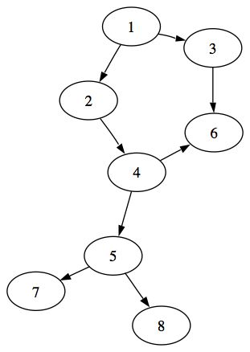
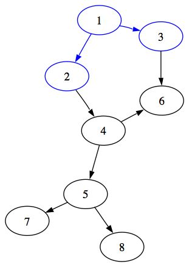
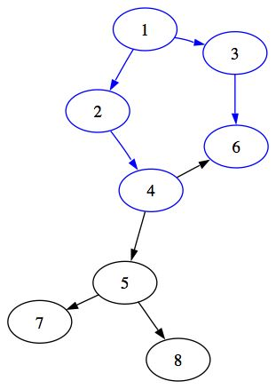

<!-- START doctoc generated TOC please keep comment here to allow auto update -->
<!-- DON'T EDIT THIS SECTION, INSTEAD RE-RUN doctoc TO UPDATE -->
**Table of Contents**  *generated with [DocToc](https://github.com/thlorenz/doctoc)*

- [Graphes](#graphes)
	- [Définition](#définition)
	- [Notation](#notation)
		- [Exemple](#exemple)
		- [Exemple de Répresentation](#exemple-de-répresentation)
	- [Complexité temporelle](#complexité-temporelle)
	- [Caractéristiques](#caractéristiques)
	- [Parcours](#parcours)
		- [Parcours en profondeur (Depth-First Search)](#parcours-en-profondeur-depth-first-search)
			- [Propriétés du parcours en profondeur](#propriétés-du-parcours-en-profondeur)
		- [Parcours en largeur (Breadth-First Search)](#parcours-en-largeur-breadth-first-search)
			- [Propriétés du parcours en largeur](#propriétés-du-parcours-en-largeur)
			- [Exemple :](#exemple-)

<!-- END doctoc generated TOC please keep comment here to allow auto update -->

# Graphes
## Définition  

`G = (V,E)`

## Notation
| Étiquette | Signification |
| :---: | :---: |
| G | un Graphes |
| V | un ensemble de sommets (vertices, noeuds) |
| E | une collection d'arêtes (edges, arcs) |
### Exemple  

```
G = (V,E)                           
V = \{a, b, c\}                     
E = \{(a,b), (a,c), (b,c), (c,b)\}  
```

### Exemple de Répresentation


## Complexité temporelle 

| Algorithme | Complexité |
| :---: | :---: |
| parcours en profondeur et largeur | O(n + m) |
| Verifier si deux noeuds sont connectés | O(1) |
| Enumérer arêtes connectés à un sommet  | O(n) |

## Caractéristiques

| Caractéristique | Description | Exemple |
| :---: | :---: | :---: |
|Orienté | Si les arcs ont un sens (représenté par une flèche), le graphe est orienté.| |
| Non orienté | Dans ce cas, on peut parcourir le graphe dans les deux sens. |  |
| Pondéré / non pondéré | Un graphe est pondéré si ses arcs ont un poids (par exemple la distance en km entre deux villes). |  |
| Cyclique | Un graphe est cyclique s'il contient des chemins finissant là où ils ont commencé (des cycles). |  |
| Acyclique | Lorsque le graphe ne contient aucun cycle, il est acyclique. |  |
| Dense | Si le nombre d'arcs est proche du nombre maximum d'arcs possibles de ce graphe, il est dense. |  |
| Creux | Au contraire, si le nombre d'arcs est faible par rapport au nombre de nœuds, il est caractérisé de creux. |  |
| Connexe / non connexe | Un graphe est dit connexe s'il existe un chemin (de un ou plusieurs nœuds) reliant chaque paire de nœuds possible. |  |

## Parcours
### Parcours en profondeur (Depth-First Search)
- Visite tous les sommets et toutes les arêtes de G 
- Détermine si G est connexe ou non
- Calcule les composantes connexes de G
- Calcule une forêt couvrante pour G
  
#### Propriétés du parcours en profondeur
- **Propriété 1:** 
  
  DFS(G,s) visite tous les sommets et les arêtes de la composante connexe de s

- **Propriété 2:** 
  
  Les arêtes sélectionnées lors du parcours DFS(G,s) forme un arbre couvrant pour la composant connexe de s

### Parcours en largeur (Breadth-First Search)
- Visite tous les sommets et toutes les arêtes de G 
- Détermine si G est connexe ou non
- Calcule les composantes connexes de G
- Calcule une forêt couvrante pour G

#### Propriétés du parcours en largeur

- **Propriété 1:**

Un sommet déjà  visité ne doit pas être revisité.

- **Propriété 2:** 

On explore les sommets successeurs directs


`NB : que avec le parcour en largeur qu'on trouve le plus court chemin`

#### Exemple : 

| Etapes | Detailles | Images |
| :---: | :---: | :---: |
| 1 | On part du sommet `1`, on liste tous les sommets successeurs, il s'agit donc des sommets `2` et `3`. Marquons les d'une couleur différente pour ne pas les passer deux fois| |
| 2 | Il n'y a plus de sommets directement accessibles à partir du sommet `1`. Il faut donc maintenant chercher ceux qui sont accessibles en passant par un sommet. Ceci revient en fait à chercher les successeurs des sommets précédemment parcourus. On doit donc parcourir à nouveau en largeur mais en partant des sommets précedemment explorés. On commence par le sommet `2`, le seul successeur est le sommet `4`, on l'affiche et on le marque comme étant parcouru. On passe au sommet `3`, tout comme le sommet `2`, il n'a qu'un seul successeur. On le marque comme déjà  parcouru | |

On vient donc de parcourir tous les sommets accessibles depuis le sommet 1 en passant par un sommet. Il faut donc maintenant parcourir les commets accessibles en passant par deux sommets.

Il faut donc parcourir en partant des sommets 4 et 6. Le sommet 4 a deux successeurs, le sommet 5 et le sommet 6. Or le sommet 6 a déjà été visité, on ne doit donc pas le mettre dans la file des sommets à parcourir. On ajoutera seulement le sommet 5 à la file des sommets à parcourir.

Concernant le parcours à partir du sommet 6, il n'y a rien à faire, en effet, celui ci n'a pas de successeurs.

On réitère le processus jusqu'à avoir parcouru tous nos sommets.

Essayons maintenant de dégager un algorithme de cet exemple. Il parait assez clair qu'il faut avoir une file pour stocker la liste des sommets à parcourir et qu'il nous faut un moyen d'identifier les sommets déjà parcourus.

Pour identifier les sommets parcourus, habituellement, on utilise le coloriage. Généralement, un sommet est blanc s'il n'a pas été parcouru et est noir dans le cas contraire. Certains mettent les sommets à parcourir en gris mais cela n'a aucun intérêt pour le fonctionnement de l'algorithme, il s'agit juste d'un moyen pour visualiser le parcours.