<!-- START doctoc generated TOC please keep comment here to allow auto update -->
<!-- DON'T EDIT THIS SECTION, INSTEAD RE-RUN doctoc TO UPDATE -->
**Table of Contents**  *generated with [DocToc](https://github.com/thlorenz/doctoc)*

- [Graphes](#graphes)
	- [Définition](#définition)
	- [Notation](#notation)
		- [Exemple](#exemple)
	- [Complexité temporelle](#complexité-temporelle)
	- [Caractéristiques](#caractéristiques)
	- [Parcours](#parcours)
		- [Parcours en profondeur (Depth-First Search)](#parcours-en-profondeur-depth-first-search)
			- [Propriétés du parcours en profondeur](#propriétés-du-parcours-en-profondeur)
			- [Exemple](#exemple-1)
		- [Parcours en largeur (Breadth-First Search)](#parcours-en-largeur-breadth-first-search)
			- [Propriétés du parcours en largeur](#propriétés-du-parcours-en-largeur)
			- [Exemple :](#exemple-)
- [Floyd-Warshall](#floyd-warshall)
- [L’algorithme de Dijkstra](#lalgorithme-de-dijkstra)

<!-- END doctoc generated TOC please keep comment here to allow auto update -->

# Graphes
[Resource](https://homepages.laas.fr/huguet/drupal/sites/homepages.laas.fr.huguet/files/u78/2018-2019-GRAPHES-V0.pdf)
## Définition  

`G = (V,E)`

## Notation
| Étiquette | Signification |
| :---: | :---: |
| G | un Graphes |
| V | un ensemble de sommets (vertices, noeuds) | 
| E | une collection d'arêtes (edges, arcs) |
### Exemple  

```
G = (V,E)                           
V = \{a, b, c\}       
E = \{(a,b), (a,c), (b,c), (c,b)\}  
ou E = {(a,c,3),(b,a,3),(c,a,3),(c,d,3),(d,b,4), (d,e,3),(e,c,15),(e,d,3)}             
```


## Complexité temporelle 

| Algorithme | Complexité |
| :---: | :---: |
| parcours en profondeur et largeur | O(n + m) |
| Verifier si deux noeuds sont connectés | O(1) |
| Enumérer arêtes connectés à un sommet  | O(n) |

## Caractéristiques

| Caractéristique | Description | Exemple |
| :---: | :---: | :---: |
|Orienté | Si les arcs ont un sens (représenté par une flèche), le graphe est orienté.| 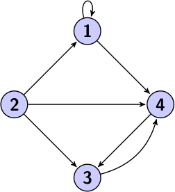|
| Non orienté | Dans ce cas, on peut parcourir le graphe dans les deux sens. | 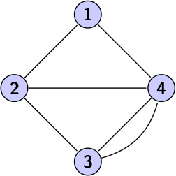 |
| Pondéré / non pondéré | Un graphe est pondéré si ses arcs ont un poids (par exemple la distance en km entre deux villes). | 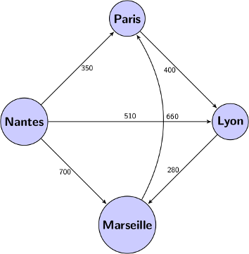 |
| Cyclique | Un graphe est cyclique s'il contient des chemins finissant là où ils ont commencé (des cycles). | 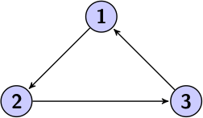 |
| Acyclique | Lorsque le graphe ne contient aucun cycle, il est acyclique. | 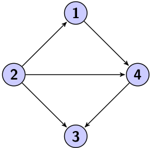 |
| Dense | Si le nombre d'arcs est proche du nombre maximum d'arcs possibles de ce graphe, il est dense. | 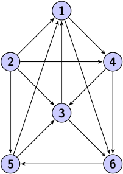 |
| Creux | Au contraire, si le nombre d'arcs est faible par rapport au nombre de nœuds, il est caractérisé de creux. | 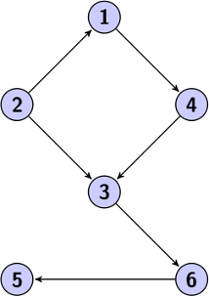 |
| Connexe / non connexe | Un graphe est dit connexe s'il existe un chemin (de un ou plusieurs nœuds) reliant chaque paire de nœuds possible. | 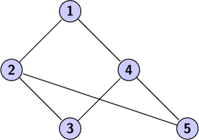 |

## Parcours
### Parcours en profondeur (Depth-First Search)
- Visite tous les sommets et toutes les arêtes de G 
- Détermine si G est connexe ou non
- Calcule les composantes connexes de G
- Calcule une forêt couvrante pour G
  
#### Propriétés du parcours en profondeur
- **Propriété 1:** 
  
  DFS(G,s) visite tous les sommets et les arêtes de la composante connexe de s

- **Propriété 2:** 
  
  Les arêtes sélectionnées lors du parcours DFS(G,s) forme un arbre couvrant pour la composant connexe de s

#### Exemple 
📚 [Refernce](https://www.metasyntactic.io/index.php/2019/11/16/graphes-iii-parcours-en-profondeur/)
<div align="center">

Considérons le graphe suivant:

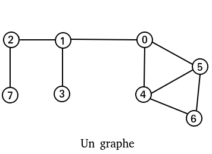

Choisissons le nœud `0` comme origine. C’est à partir de ce nœud que nous parcourrons le graphe.

Marquons le nœud `0` comme visité:

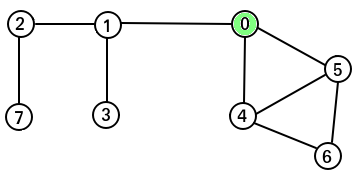

`Le noeud 0 est visité.`

Les nœuds voisins de `0` sont `1`, `4` et `5`. Nous commençons par le nœud `5`.

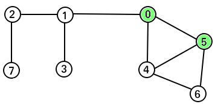

`Le noeud 5 est visité.`

`5` a trois voisins: `0`, `4` et `6`. `0` est déjà visité. Restent `4` et `6`.

Nous visitions `6`:

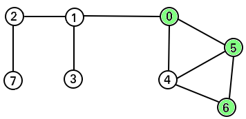

`Le noeud 6 est visité.`

`6` n’a qu’un voisin non visité: le noeud `4`.

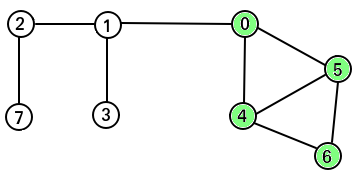

`Le noeud 4 est visité.`

Le nœud `4` n’a pas de nœuds voisins non visités. On revient donc en arrière (backtracking) au nœud `6`. De même, le nœud `6` n’a pas de voisins non visités. Nous backtrackons alors jusqu’au nœud `5`, puis enfin au nœud `0`.

Nous venons d’explorer en profondeur la branche de l’arrête (`0`, `5`).

`0` a encore un voisin non exploré: le nœud `1`. Explorons désormais la branche créée par l’arrête (`0`, `1`):


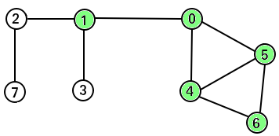

`Le noeud 1 est visité.`

`1` a deux voisins non visités: `2` et `3`. Visitons `3`:

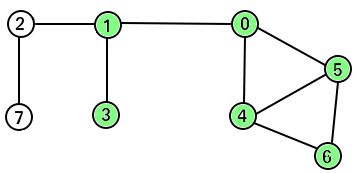

`Le noeud 3 est visité.`

Enfin, visitons `2`:

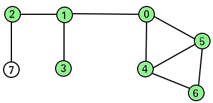

`Le noeud 2 est visité.`

Pour finir avec `7`:

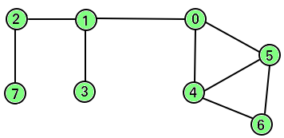

`Le noeud 8 est visité.`

Nous venons de visiter tout le graphe en profondeur.

</div>

**Que se passe-t-il?**

En partant d’un `nœud racine` **N**, l’algorithme va explorer les arrêtes de N pour trouver les nœuds directement accessibles depuis **N**.

On dit que le `DFS` parcourt le graphe `en profondeur` puisqu’il va le plus loin possible à partir d’un voisin du nœud racine, puis dès qu’il ne peut plus continuer, il `backtrack` jusqu’à pouvoir s’enfoncer à nouveau dans une autre branche.

### Parcours en largeur (Breadth-First Search)
- Visite tous les sommets et toutes les arêtes de G 
- Détermine si G est connexe ou non
- Calcule les composantes connexes de G
- Calcule une forêt couvrante pour G

#### Propriétés du parcours en largeur

- **Propriété 1:**

Un sommet déjà  visité ne doit pas être revisité.

- **Propriété 2:** 

On explore les sommets successeurs directs


`NB : que avec le parcour en largeur qu'on trouve le plus court chemin`

#### Exemple : 
📚 [Refernce](https://www.metasyntactic.io/index.php/2019/10/27/graphes-ii-parcours-en-largeur/)
<div align="center">
Considérons le graphe suivant:


Choisissons le nœud `0` comme origine. C’est à partir de ce nœud que nous parcourrons le graphe.

Marquons le nœud `0` comme visité:

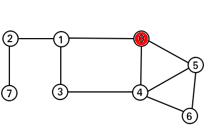

`Le noeud 0 est marqué comme visité.`

Nous visitons ensuite les nœuds voisins de `0`, c’est à dire `1`, `3`, `4` et `5`.

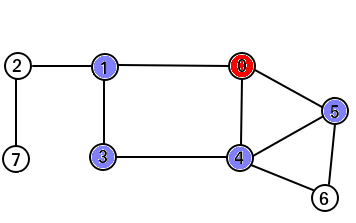

`Les noeud voisins de 0 sont marqués comme visités.`

Le voisin non visité de `1` est `2`, et le voisin non visité de `4` et `5` est le nœud `6`. Visitions alors `2` et `6`:

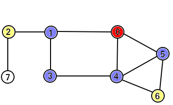

`Les noeuds 2 et 6 sont marqués comme visités.`

`Ils sont une troisième “profondeur” de graphe.`


Enfin, le dernier nœud non visité est `2`:

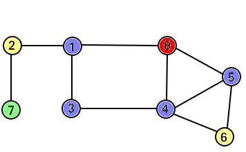

`Tous les noeuds sont enfin visités.`

</div> 

**QUE SE PASSE-T-IL?**

En partant d’un `nœud racine` **N**, l’algorithme va explorer les `arrêtes` de **N** pour trouver les nœuds directement accessibles depuis **N**.

On dit que le BFS parcourt le graphe en largeur puisqu’il visite d’abord tous les voisins d’un nœud (largeur), avant d’approfondir vers les nœuds suivants.

On va donc d’abord découvrir tous les nœuds voisins du nœud racine **N**, puis tous les voisins des voisins, puis leurs voisins…et ainsi de suite jusqu’à ce que tout le graphe ait été visité.

Le BFS porte ce nom puisqu’il étend la frontière entre les nœuds visités et les nœuds non-visités selon la largeur du graphe.

# Floyd-Warshall
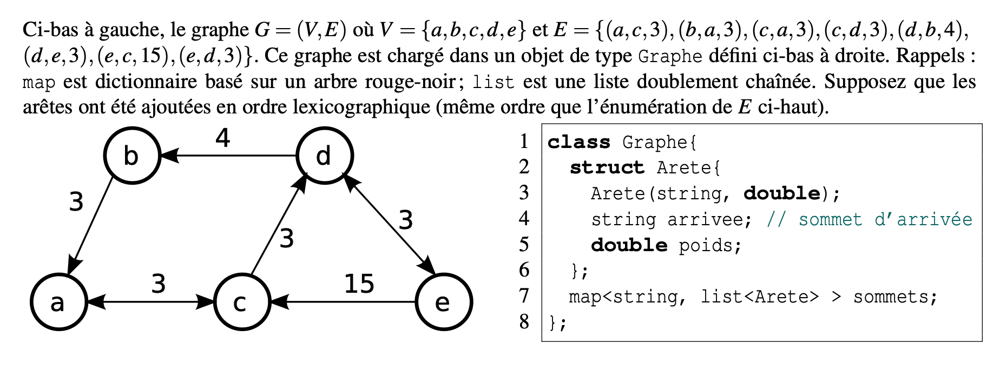
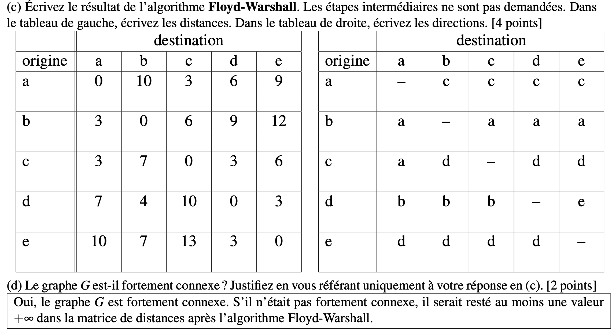

# L’algorithme de Dijkstra