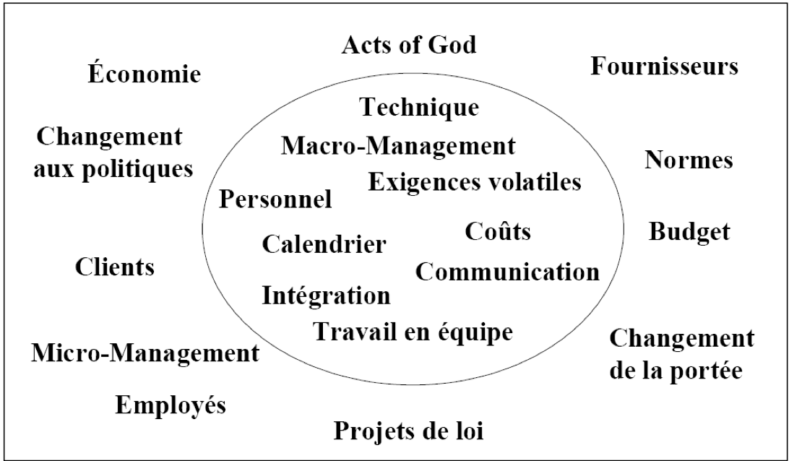
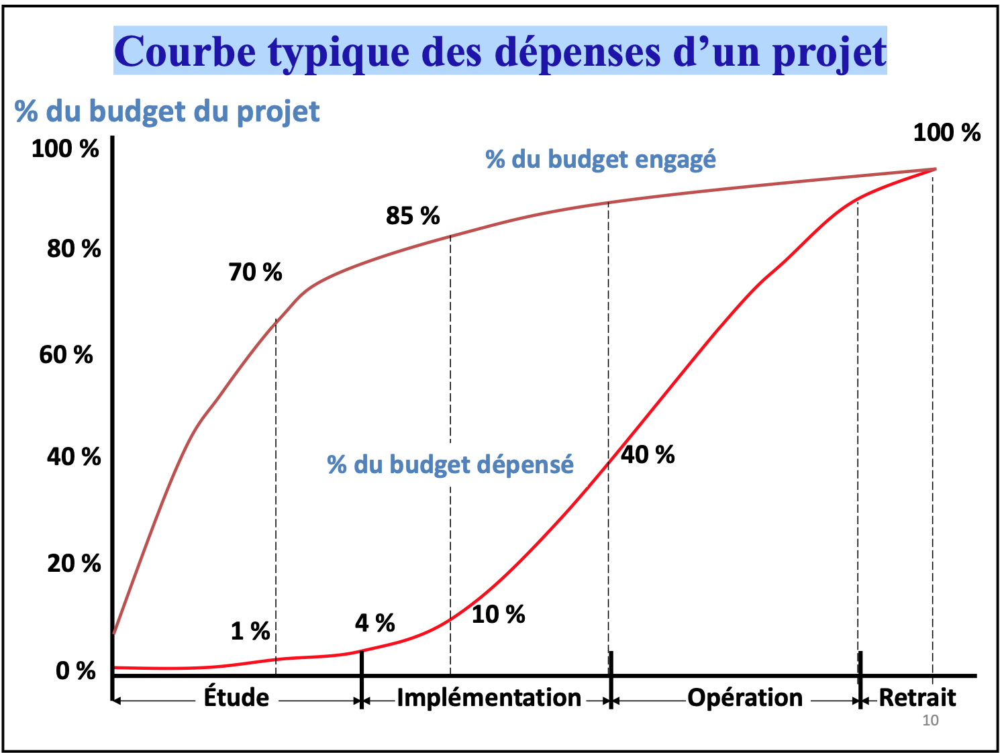
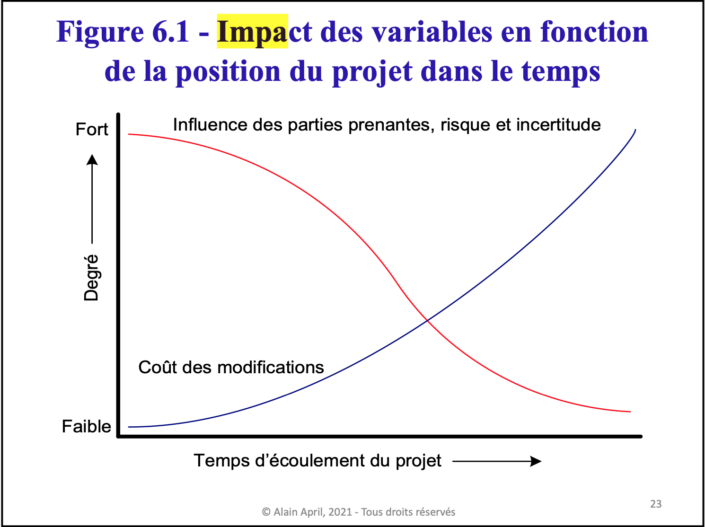
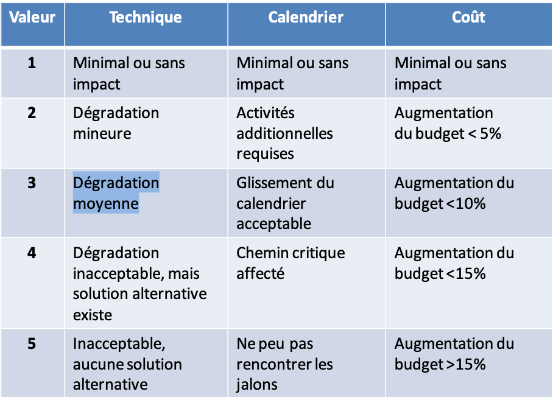

<!-- START doctoc generated TOC please keep comment here to allow auto update -->
<!-- DON'T EDIT THIS SECTION, INSTEAD RE-RUN doctoc TO UPDATE -->
**Table of Contents**  *generated with [DocToc](https://github.com/thlorenz/doctoc)*
- [1 Gestion de projet - intro](#1-gestion-de-projet---intro)
	- [Qu’est-ce que la gestion de projet logiciel et quel est son but?](#quest-ce-que-la-gestion-de-projet-logiciel-et-quel-est-son-but)
		- [La définition](#la-définition)
	- [Qu’est-ce que la gestion de projet logiciel et quel est son but?](#quest-ce-que-la-gestion-de-projet-logiciel-et-quel-est-son-but-1)
		- [Le but](#le-but)
	- [Les caractéristiques de la gestion de projet « waterfall »](#les-caractéristiques-de-la-gestion-de-projet--waterfall-)
		- [La définition](#la-définition-1)
		- [Étapes clés](#étapes-clés)
	- [Les grandes étapes de projets](#les-grandes-étapes-de-projets)
	- [Les diagrammes de flexibilité/leviers](#les-diagrammes-de-flexibilitéleviers)
	- [Priorisation « MoSCoW »](#priorisation--moscow-)
	- [L’importance de la qualité](#limportance-de-la-qualité)
- [2 Gestion de projet classique](#2-gestion-de-projet-classique)
	- [Processus de planification de projet](#processus-de-planification-de-projet)
	- [Les techniques de planification](#les-techniques-de-planification)
	- [La charte de projet, matrice RACI, diagramme de Gantt](#la-charte-de-projet-matrice-raci-diagramme-de-gantt)
		- [Une charte d'équipe](#une-charte-déquipe)
		- [La charte de projet](#la-charte-de-projet)
		- [Matrice RACI](#matrice-raci)
		- [Diagramme de Gantt](#diagramme-de-gantt)
			- [Le diagramme de Gantt de tâches](#le-diagramme-de-gantt-de-tâches)
	- [Les différentes techniques d’estimation de projet (à haut niveau)](#les-différentes-techniques-destimation-de-projet-à-haut-niveau)
		- [Estimation (à l’aide des points de fonction)](#estimation-à-laide-des-points-de-fonction)
- [3 Gestion de projet moderne](#3-gestion-de-projet-moderne)
	- [Ce que sont les caractéristiques de l’approche AGILE](#ce-que-sont-les-caractéristiques-de-lapproche-agile)
		- [Introduction](#introduction)
		- [Quoi mettre dans votre plan de projet lors de la planification d’un projet Agile](#quoi-mettre-dans-votre-plan-de-projet-lors-de-la-planification-dun-projet-agile)
	- [Les rituels et livrables sous une méthodologie SCRUM](#les-rituels-et-livrables-sous-une-méthodologie-scrum)
		- [3 rôles dans cette méthodologie:](#3-rôles-dans-cette-méthodologie)
		- [Mêlées et Itérations:](#mêlées-et-itérations)
	- [Les rituels et livrables sous une méthodologie KANBAN](#les-rituels-et-livrables-sous-une-méthodologie-kanban)
	- [Les rituels et livrables sous une méthodologie SAFe/Devops](#les-rituels-et-livrables-sous-une-méthodologie-safedevops)
		- [SAFE](#safe)
		- [Devops](#devops)
- [4 Gestion des risques](#4-gestion-des-risques)
	- [Être capable de créer une charte des risques](#être-capable-de-créer-une-charte-des-risques)
		- [Types de risques](#types-de-risques)
	- [Connaitre les sources des risques](#connaitre-les-sources-des-risques)
	- [Comprendre la courbe typique des dépenses d’un projet](#comprendre-la-courbe-typique-des-dépenses-dun-projet)
	- [Comprendre le diagramme d’impact des variables vs temps](#comprendre-le-diagramme-dimpact-des-variables-vs-temps)
	- [Techniques pour l’identification des risques](#techniques-pour-lidentification-des-risques)
	- [Comprendre les notions d’évaluation de probabilité, de conséquence et les relations entre elles](#comprendre-les-notions-dévaluation-de-probabilité-de-conséquence-et-les-relations-entre-elles)
	- [Comprendre les notions de mitigation et contingence](#comprendre-les-notions-de-mitigation-et-contingence)
- [5 La technique du sunset graph](#5-la-technique-du-sunset-graph)
	- [Être capable de créer un diagramme de sunset graph](#être-capable-de-créer-un-diagramme-de-sunset-graph)
	- [Être en mesure d’interpréter le sunset graph](#être-en-mesure-dinterpréter-le-sunset-graph)
- [6 La culture qualité](#6-la-culture-qualité)
	- [Connaitre les composants du coût de la qualité](#connaitre-les-composants-du-coût-de-la-qualité)
	- [Comprendre le coût de la propagation des erreurs](#comprendre-le-coût-de-la-propagation-des-erreurs)
	- [Savoir ce qu’est un code de déontologie](#savoir-ce-quest-un-code-de-déontologie)
- [7 Les exigences qualité](#7-les-exigences-qualité)
	- [Différence entre exigences fonctionnelles et non-fonctionnelles](#différence-entre-exigences-fonctionnelles-et-non-fonctionnelles)
	- [Le modèle normalisé ISO 25000](#le-modèle-normalisé-iso-25000)
	- [Le modèle normalisé IEEE1061](#le-modèle-normalisé-ieee1061)
- [8 La gestion des fournisseurs](#8-la-gestion-des-fournisseurs)
	- [Les 6 activités du processus d’acquisition ISO 12207](#les-6-activités-du-processus-dacquisition-iso-12207)
	- [Les 5 types de contrats](#les-5-types-de-contrats)
- [9 Revues et audits](#9-revues-et-audits)
	- [Où et quand effectuer des revues](#où-et-quand-effectuer-des-revues)
	- [Graphique de création et détection des erreurs](#graphique-de-création-et-détection-des-erreurs)
	- [Être capable de calculer l’impact de ne faire que des tests vs revues & tests](#être-capable-de-calculer-limpact-de-ne-faire-que-des-tests-vs-revues--tests)
	- [Connaitre les caractéristiques des différents types de revues](#connaitre-les-caractéristiques-des-différents-types-de-revues)
- [10 Les tests](#10-les-tests)
	- [Connaître les différents types de tests](#connaître-les-différents-types-de-tests)
	- [Stratégie boite noire](#stratégie-boite-noire)
		- [Les classes d’équivalences](#les-classes-déquivalences)
		- [Valeurs frontalières](#valeurs-frontalières)
		- [Graphe causes à effets](#graphe-causes-à-effets)
		- [Tables de décisions](#tables-de-décisions)
	- [Stratégie boite blanche](#stratégie-boite-blanche)
		- [Calcul de la complexité cyclomatique](#calcul-de-la-complexité-cyclomatique)
		- [Tables de conditions multiples](#tables-de-conditions-multiples)
	- [Les outils de tests](#les-outils-de-tests)
- [11 Les normes](#11-les-normes)
	- [Ce que sont les normes et leurs bénéfices](#ce-que-sont-les-normes-et-leurs-bénéfices)
	- [Les caractéristiques et raisons d’êtres des normes et modèles:](#les-caractéristiques-et-raisons-dêtres-des-normes-et-modèles)
		- [PMBOK](#pmbok)
		- [BABOK](#babok)
		- [CMMI](#cmmi)
		- [S3M](#s3m)
		- [ISO 9001/ISO 900003](#iso-9001iso-900003)
		- [ITIL et ISO 20000](#itil-et-iso-20000)
		- [ISO 27000](#iso-27000)
		- [CobIT](#cobit)
- [12 Gestion de configuration](#12-gestion-de-configuration)
	- [Rôle de la gestion de configuration](#rôle-de-la-gestion-de-configuration)
	- [Problèmes qui résultent d’une gestion de configuration déficiente](#problèmes-qui-résultent-dune-gestion-de-configuration-déficiente)
- [13 Politiques et processus](#13-politiques-et-processus)
	- [Les 4 éléments de structure documentaire des politiques et processus](#les-4-éléments-de-structure-documentaire-des-politiques-et-processus)
	- [Les diagrammes de type « swilane »](#les-diagrammes-de-type--swilane-)
	- [Les diagrammes de type « swilane »](#les-diagrammes-de-type--swilane--1)
  

<!-- END doctoc generated TOC please keep comment here to allow auto update -->
# 1 Gestion de projet - intro
:books: [PDF Chapitre 1](https://www.moodle2.uqam.ca/coursv3/pluginfile.php/4666627/mod_resource/content/6/Chapitre01-IntoGP-AQL-revST.pdf)
## Qu’est-ce que la gestion de projet logiciel et quel est son but? 
:books: [Source](https://asana.com/fr/resources/benefits-project-management)
### La définition
## Qu’est-ce que la gestion de projet logiciel et quel est son but?
:books: [Source](https://asana.com/fr/resources/benefits-project-management)
```
La gestion de projet aide les équipes à organiser, suivre et accomplir l’ensemble des activités se rapportant 
à un projet, que l’on pourrait définir comme une succession de tâches à réaliser pour parvenir à un objectif donné. 
Votre équipe peut ainsi mieux planifier, gérer et réaliser le travail nécessaire pour répondre aux besoins du projet 
dans les temps impartis.
```
### Le but
```
Le but est de renforcer la collaboration entre les membres de votre équipe, qui peuvent organiser tous 
les détails liés à leurs activités au même endroit, partager leur avis et rendre compte de leur progression.
```
## Les caractéristiques de la gestion de projet « waterfall »
:books: [Source](https://www.wimi-teamwork.com/fr/blog/methode-waterfall-guide-introduction-debutants/)
:books: [Source Agile VS waterfall](https://startprojectingnow.com/fr/agile-vs-waterfall-il-ny-a-pas-de-solution-unique-pour-tout-le-monde/)
### La définition
```
La méthode waterfall, aussi appelée « en cascade », consiste à gérer un projet en suivant des phases linéaires 
et séquentielles. 
Chaque phase est consacrée à des tâches en particulier et dépend des résultats de la phase précédente.
De la même façon que l’eau qui descend une cascade ne peut pas remonter, l’équipe projet ne peut pas (ou presque pas) 
revenir en arrière. Après chaque étape terminée, il faut passer à la suivante. Le projet suit une direction précise 
et atteint son objectif final en suivant chaque étape, l’une après l’autre.
```
### Étapes clés

- Exigences (requirements) : analyse et expression des besoins du donneur d’ordre ;
- Analyse : élaboration du cahier des charges et définition des spécifications fonctionnelles ;
- Conception du projet : c’est-à-dire sa planification ;
- Mise en œuvre : la réalisation du produit selon les specs ;
- Validation (test) : le produit est testé par l’équipe projet et vérifié par le donneur d’ordre ;
- Mise en service : le produit est validé.

## Les grandes étapes de projets
:books: [Source](https://www.kpulse.fr/blog/conseils-pratiques/les-etapes-incontournables-pour-bien-gerer-un-projet)
- la définition des objectifs du projet
- l'identification des tâches
- l'organisation des tâches et des ressources
- l'évaluation des risques et des contraintes
- le choix des bons outils de gestion de projet
- la planification du suivi du projet
## Les diagrammes de flexibilité/leviers
```
SOS
```
## Priorisation « MoSCoW » 
:books: [Source](https://www.manager-go.com/gestion-de-projet/dossiers-methodes/methode-moscow)
- **M** : une exigence essentielle, voire vitale, qui doit être réalisée « Must have this » ;
- **S** : une exigence importante « Should have this if at all possible » ;
- **C** : une exigence de confort (souhaitable) pourrait être réalisée dans la mesure où elle n'a pas d’impact sur les autres tâches « Could have this if it does not affect anything else » ;
- **W** : une exigence considérée un luxe qui ne sera pas réalisée maintenant, mais pourrait être réalisée plus tard « Won’t have this time but would like in the future ».

## L’importance de la qualité
:books: [Source](https://hellodarwin.com/fr/blogue/importance-gestion-projets)
```
Une bonne gestion de projets exige une grille d’évaluation d’étapes à partir de laquelle les équipes peuvent évaluer les résultats en matière de qualité, de faisabilité et de rendement du capital investi (RCI). La gestion de projets fait partie intégrante de l’assurance de la qualité, car elle permet d’établir des étapes et des phases au processus, donnant le temps aux équipes d’évaluer et de tester les résultats à chacune des étapes.
```
# 2 Gestion de projet classique
:books: [PDF Chapitre 2](https://www.moodle2.uqam.ca/coursv3/pluginfile.php/4666628/mod_resource/content/3/2-Gestion%20de%20projets%20plus%20classique-19-jan-2021.pdf)
## Processus de planification de projet
:books: [Source COURS](https://www.moodle2.uqam.ca/coursv3/pluginfile.php/4699565/mod_resource/content/1/Chapitre%202%20-%20révisé%2020-01-2021.pdf)

devrait inclure typiquement les activités décrites dans la table des matières suivante :
- **1.0 Introduction**
- **2.0 Contenu du projet :**
	- 2.1 Description de la situation actuelle : Cette section décrit le contexte actuel, rappel de la problématique et des circonstances qui amènent le projet; forces, faiblesses, menaces, compétition;
	- 2.2 Objectifs d’affaires : Cette section explique les raisons pour lesquelles le projet doit être entrepris;
	- 2.3 Description du produit (logiciel) : Cette section image les caractéristiques du système :
		- 2.3.1 Vue schématique du système existant/futur;
		- 2.3.2 Explication de la vue schématique.
	- 2.4 Les limites du projet : Cette section documente ce qui est inclus dans le projet et énonce explicitement les exclus du projet, au cas où une partie prenante pourrait supposer qu’un produit, service ou un résultat particulier puisse être un composant du projet;
	- 2.5 Structure de découpage du projet (WBS);
	- 2.6 Produits livrables du projet : Cette section décrit les grandes phases du projet ainsi que leur date prévue de début et date de fin;
	- 2.7 Critères d’acceptation du produit : Cette section décrit les critères d’acceptation du produit fini. Par exemple : le nombre d’exigence fonctionnelles à réaliser, le critère de niveau de performance à rencontrer, le niveau de disponibilité à rencontrer. Ce sont les critères et les conditions essentielles doivent être satisfaites avant de considérer effectuer l’acceptation d’un livrable avec le client;
- **3.0 Contraintes :** Cette section décrit les contraintes du projet. Une contrainte est une obligation créée par une règles, une loi, une directive. Les contraintes créent des restrictions ou des limitations, interne ou externe au projet;
- **4.0 Hypothèses :** Dans un but de planification, les hypothèses sont des facteurs considérés vrais, réels ou certains sans preuve ni démonstration. Elles ont un impact sur tous les aspects de la planification du projet et font partie de son élaboration progressive. Les équipes de projet émettent, documentent et confirment souvent les hypothèses lors du processus de planification. Les hypothèses comportent en général un degré de risque;
- **5.0 Organigramme fonctionnel du projet :** Au sein d’un projet, l'organigramme fonctionnel permet d’identifier les membres d’un comité projet. L’organigramme précise qui est le responsable et quels sont les liens entre les différentes fonctions;
- **6.0 Parties prenantes et équipes de projet :**
	- 6.1 Comité de direction de projet (CDP) : Le rôle du comité de direction de projet (CDP) est principalement d’approuver les objectifs d’affaires, d’identifier les priorités et prendre des décisions lorsque des risques au niveau du budget, de l’effort et des ressources humaines ou des points en suspens sont signalés. Il approuve également toutes les demandes de changement qui ont un impact sur la portée du projet et donne son approbation pour la clôture du projet.
	- 6.2 Comité de projet (CP) : Le rôle du comité de projet est de coordonner les efforts des participants durant toutes les étapes du projet (c.-à-d. démarrage, planification, exécution, surveillance et maitrise, analyse, développement, essai, pilote, déploiement et clôture). Le comité de projet escaladera au CDP les items pour lesquels il a besoin d’aide ou d’une décision.
	- 6.3 Analyse et développement : Cette section identifie toutes personnes impliquées dans le projet comme analyste d’affaires, analyste, analyste-programmeur, ou programmeur dont le rôle est de développer les livrables du projet.
	- 6.4 Procédures : Cette section identifie toutes personnes responsables de la définition et l’écriture des procédures requise par le projet.
	- 6.5 Formation : Cette section identifie toutes personnes responsables de la définition et livraison de la formation requise dans le projet.
	- 6.6 Tests : Cette section identifie toutes personnes responsables des tests (unitaires, systèmes, intégrés, etc.).
	- 6.7 Pilote et déploiement : Cette section identifie le(s) pilote(s) associés au projet et toutes personnes responsables du déploiement.
- **7.0 Mécanisme de gestion de projet :** (qui sont abordés en détail à la section 2.7 de ce chapitre) 
	- 7.1 Gestion de l’intégration ;
	- 7.2 Gestion du contenu (portée) ;
	- 7.3 Gestion des délais (échéanciers) ;
	- 7.4 Gestion des coûts ;
	- 7.5 Gestion de la qualité ;
	- 7.6 Gestion des ressources humaines ; 
	- 7.7 Gestion des communications ;
	- 7.8 Gestion des risques ;
	- 7.9 Gestion des approvisionnements.
- **8.0 Réalisation :** Cette section indique les articles, produits ou résultats mesurables, tangibles et vérifiables devant être produits pour mener à bien le projet.
- **8.1 Cycle de vie :** Cette section indique le cycle de vie qui sera utilisé durant le projet.
- **9.0 Historique des révisions :** est un tableau qui décrit les changements effectués à ce document.
## Les techniques de planification
:books: [Source COURS](https://www.moodle2.uqam.ca/coursv3/pluginfile.php/4699565/mod_resource/content/1/Chapitre%202%20-%20révisé%2020-01-2021.pdf)

- LA PRIORISATION D’UN PROJET ET SA CHARTE DE PROJET
- LA STRUCTURE DE DÉCOUPAGE DU PROJET (WBS)
- ÉTABLIR LES RESPONSABILITÉS POUR LES ACTIVITÉS DU WBS
- REPRÉSENTER L’ORGANIGRAMME FONCTIONNEL DU PROJET
- L’ESTIMATION D’UN PROJET LOGICIEL
- LISTER LES LIVRABLES (GESTION ET TECHNIQUE) ET LEURS RESPONSABLES
- REPRÉSENTER L’ÉCHÉANCIER DU PROJET
## La charte de projet, matrice RACI, diagramme de Gantt
:books: [Source COURS](https://www.moodle2.uqam.ca/coursv3/pluginfile.php/4699565/mod_resource/content/1/Chapitre%202%20-%20révisé%2020-01-2021.pdf)

### Une charte d'équipe
```
La charte permet de préciser les orientations, le rôle et les responsabilités de l'équipe. Elle est un outil précieux pour une équipe et peut servir de guide à tout moment face aux difficultés.
C'est là où ils définissent leur compréhension commune de la meilleure façon de travailler ensemble. 
```
### La charte de projet
- l’identification du projet;
- la description de l’objectif (c.-à-d. l’alignement avec les objectifs annuels);
- les critères de sélection du projet (ex : stratégique, compétitif, obligatoire, réduction des coûts);
- la mesure de succès;
- les risques (ex : complexité, technologie, ressources disponibles);
- une analyse coût/bénéfices;
- les systèmes impactés;
- les services à impliquer pour sa réalisation, l’étape du pilote et les procédures à définir;
- un échéancier haut niveau ainsi que les principales étapes de réalisation;
- le personnel des technologies de l’information qui y seront assignées.

### Matrice RACI
```
A pour but d'améliorer la communication, d’éliminer la duplication d’effort de préciser le travail à effectuer correctement et à temps et d’éliminer le blâme et le stress. Ainsi, on veut savoir qui va faire quoi plus précisément dans le projet logiciel et TI.
```
- **R : Responsable :** ces personnes ont en charge la réalisation de la tâche pour laquelle ils sont nommés. Ils sont sous la responsabilité d’un « A ». Il relève donc de la personne imputable pour faire autoriser son résultat Logiquement chaque ligne possède au moins un « R »., 
- **A : Accountable** (c.-à-d. imputable) ces membres ont pour rôle l’approbation et la validation des actions. Ils rendent des comptes concernant leurs responsabilités. Ce sont les véritables responsables de ces tâches. Ils ont autorité sur les « R ». Chaque activité du projet doit avoir une personne dont le rôle est « A » (et une seule personne par activité). 
- **C : Consulté** est le rôle donné aux personnes qui doivent être consultées avant que la décision finale soit prise. Cette personne peut être à l’extérieur du projet. Ce sont généralement des experts qui détiennent une compétence sur la tâche en question. Ils apportent des conseils. Et finalement, 
- **I : Informé**, ce sont les personnes qui sont informées après qu’une décision soit prise (communication à un sens). Ces personnes doivent être informées même si elles n’exercent pas un rôle direct dans le projet, car elles peuvent être impactées d'une manière ou d’une autre. Elles sont en copie des points et décisions importantes.
### Diagramme de Gantt  
:books: [Source](https://www.gantt.com/fr/)

:books: [LIVRE COURS 2](https://www.moodle2.uqam.ca/coursv3/pluginfile.php/4698191/mod_resource/content/1/Chapitre%202%20-%20révisé%2020-01-2021.pdf)
```
Il existe deux types de diagrammes de Gantt: le Gantt de tâches et le Gantt de ressources.

Le diagramme de Gantt, couramment utilisé en gestion de projet, est l'un des outils les plus efficaces pour représenter visuellement l'état d'avancement des différentes activités (tâches) qui constituent un projet. La colonne de gauche du diagramme énumère toutes les tâches à effectuer, tandis que la ligne d'en-tête représente les unités de temps les plus adaptées au projet (jours, semaines, mois etc.). Chaque tâche est matérialisée par une barre horizontale, dont la position et la longueur représentent la date de début, la durée et la date de fin.
```
#### Le diagramme de Gantt de tâches
```
Le diagramme de Gantt de tâches (le plus couramment utilisé des deux) est un tracé des tâches par rapport aux heures, journées, semaines, mois – ça dépend de votre niveau de granularité. Ici ce sont des semaines auxquelles elles doivent se dérouler.
```


## Les différentes techniques d’estimation de projet (à haut niveau)
:books: [Source COURS](https://www.moodle2.uqam.ca/coursv3/pluginfile.php/4698191/mod_resource/content/1/Chapitre%202%20-%20révisé%2020-01-2021.pdf)
- **La Technique Delphi :** Qui implique plusieurs experts qui parviennent à un consensus sur un sujet ou une question en particulier. Bien que la technique de Delphi soit généralement utilisée pour la prise de décision en groupe, elle peut être un outil utile pour estimer quand le temps et l’argent justifient l’effort supplémentaire. Pour estimer la technique Delphi, plusieurs experts doivent être recrutés pour estimer le même élément. Sur la base des informations fournies, chaque expert établit un bilan et compare ensuite tous les résultats. Si les estimations sont raisonnablement proches, elles peuvent être moyennées et utilisées comme estimation. Sinon, les estimations sont redistribuées aux experts qui discutent des différences puis font une autre estimation. En général, ces tours sont anonymes et plusieurs tours peuvent avoir lieu jusqu’à ce
qu’un consensus soit atteint. Sans surprise, l’utilisation de la technique Delphi peut prendre plus de temps et coûter plus cher que la plupart des méthodes d’estimation, mais elle peut être très efficace et fournir une assurance raisonnable lorsque les enjeux sont élevés et que la marge d’erreur est faible.
- **La boite temporelle (Time Boxing) :** Est une technique par laquelle une estimation de temps fixe est allouée pour une activité ou une tâche spécifique. Cette allocation est davantage basée sur une exigence que sur de simples suppositions. Par exemple, une équipe de projet peut disposer de deux (et seulement deux) semaines pour construire un prototype. À la fin des deux semaines, les travaux sur le prototype s’arrêtent, que le prototype soit terminé à 100% ou non. Utilisée efficacement, la boxe temporelle peut aider à concentrer les efforts de l’équipe de projet sur une tâche importante et critique. La pression du calendrier pour respecter un délai particulier peut toutefois entrainer de longues heures de travail et une pression pour réussir. Utilisés de manière inappropriée ou trop souvent, les membres de l’équipe de projet sont épuisés et frustrés.
- **L’estimation descendante (Top Down) :** Cette approche consiste à estimer le calendrier e/ ou le coût de l’ensemble du projet en termes de durée ou de coût. L’estimation descendante est un phénomène très courant qui résulte souvent d’un mandat confié par la direction (par exemple, vous devez terminer le projet en six mois et ne pas dépenser plus de 500 000 $!). Souvent, le calendrier et/ou l’estimation des coûts sont le produit d’un plan stratégique où parce que quelqu’un pense que cela devrait prendre un certain temps ou coûter un certain montant. D’un autre côté, l’estimation top-down pourrait être une réaction à l’environnement des affaires. Par exemple, il se peut que le projet doive être achevé dans un délai de six mois à la suite des actions d’un concurrent ou pour gagner les affaires d’un client (c’est-à-dire que le client en a besoin dans six mois). Une fois que les objectifs cibles en termes de calendrier ou de budget sont identifiés, il appartient au chef de projet d’affecter des pourcentages aux différentes phases du cycle de vie du projet et aux tâches ou activités associées. Les données de projets antérieurs peuvent être très utiles pour appliquer des pourcentages et garantir que les estimations sont raisonnables. Il est important de garder à l’esprit que l’estimation top-down fonctionne bien lorsque les objectifs cibles sont raisonnables, réalistes et réalisables. Toutefois, lorsque ces objectifs sont définis par des personnes indépendantes de l’équipe du projet, ils sont souvent trop optimistes ou trop agressifs.
- **L’estimation à l’aide de la taille fonctionnelle (Point de fonction):** Cette approche consiste à assigner un certain nombre de points aux fonctionnalités du logiciel à développer. Plus les fonctionnalités détaillées à développer sont connues et bien définies plus la dimension ou la taille du logiciel sera précise. L’idée principale derrière la mesure de taille fonctionnelle d’un logiciel COSMIC www.cosmic-sizing.org est que le logiciel est constitué de dizaine, de centaine voire de millier de processus. Tout processus comprend des « données » à l’entrée, des traitements et des résultats. Par exemple, une alarme est le résultat d’un processus qui comprend une ou des données d’entrée (par exemple la coupure d’un rayon laser) qui se déclenche une réaction (c.-à-d. des traitements). Autre exemple, je peux demander un rapport sur un client. Pour ce faire je dois demander le rapport (entrer des données sur le client), qui déclenche une recherche dans une base de données pour obtenir des informations prédéfinies (c.-à-d. une lecture) et obtenir mon rapport (une sortie). Ces processus peuvent être visibles ou non à un utilisateur/client, mais les spécialistes en génie logiciel savent que ces actions devront être codées. COSMIC s’intéresse donc à détailler les exigences fonctionnelles ou processus fonctionnels qui sont typiquement décrits dans des diagrammes UML. Que mesure la méthode COSMIC ? Elle mesure les mouvements de données à l’intérieur d’un processus fonctionnel. Il y a quatre types de mouvements de données pour COSMIC: 1) entrée; 2) sortie; 3) lecture; et 4) écritures. Que faut-il savoir pour mesurer la taille fonctionnelle avec COSMIC ?
- **Les story points :** Les story points permettent aux équipes de s’accorder sur la taille relative des user stories. Estimer le travail en jours/personne, va les forcer à se poser la question « Qui ferait la tâche ? ». La story 1 représente 3 fois plus d’effort que la story 2, et ce, même si le temps réel de réalisation varie en fonction des membres de l’équipe. En résumé, on choisit de faire une estimation relative plutôt qu’absolue. Estimer l’effort de manière relative a une seconde vertu : prendre en compte l’imprécision. Le calcul d'incertitude est imprécis par nature puisqu’il est impossible de prévoir l’avenir. Pour un projet Agile c’est plus simple. La philosophie est : pourquoi perdre notre temps et notre énergie à tenter d’estimer précisément le temps que prendra chaque tâche d’un projet dès lors qu’on admet que le résultat de l’estimation de toute façon vraisemblablement faux ? Les estimations relatives, plus grossières, sont nettement suffisantes étant donné la marge d’erreur. Elles nous fournissent d’abord un ordre d’idée de la taille d’un projet et cette vision s’affinera ensuite progressivement lors des phases de réalisation. Autrement dit, on apprend à partir de données réelles et cela nous permet de préciser nos plans. À l’aide de la technique d’estimation de « story points », on utilise d’ailleurs le plus souvent une estimée inspirée de la suite de Fibonacci : 1, 2, 3, 5, 8, 13, 20, 40, 100. Cette suite propose des valeurs de plus en plus éloignées les unes des autres, donc des estimations de plus en plus imprécises lorsque la valeur augmente en durée prévue. Cela permet de prendre en compte que plus une « user story » est imprécise ou complexe, plus elle devient difficile à estimer. Notons pour terminer qu’il est possible au début d’un projet d’utiliser des macros-estimations, par exemple en s’inspirant des tailles de T-shirt (c.-à-d. XS, S, M, L, XL) pour comparer des « Epics » ou des « Features » entre elles.
- **L’estimation ascendante (Bottom-up):** La plupart des estimations dans le monde réel sont effectuées à l’aide d’estimations ascendantes. L’estimation ascendante implique de diviser le projet en modules plus petits, puis d’estimer directement le temps et les efforts en heures-personnes, en semaines-personnes ou en mois-personnes pour chaque module. La structure de répartition du travail constitue la base de l’estimation ascendante, car toutes les phases et activités du projet sont définies. Le chef de projet, ou mieux encore l’équipe de projet, peut fournir une estimation du temps raisonnable pour chaque activité. En bref, l’estimation ascendante commence par une liste de toutes les tâches ou activités requises, puis une estimation de la quantité d’effort est effectuée. Le temps total et le coût associé pour chaque activité constituent la base du calendrier et du budget ciblé du projet. Bien que l’estimation ascendante soit simple, il peut être difficile de confondre les efforts avec les progrès. En reprenant notre exemple précédent, supposons qu’après la réunion avec nos testeurs de logiciels,
### Estimation (à l’aide des points de fonction)
:books: [Page 39 et 40](https://www.moodle2.uqam.ca/coursv3/pluginfile.php/4666628/mod_resource/content/3/2-Gestion%20de%20projets%20plus%20classique-19-jan-2021.pdf)

pf: point de fonction 

`PF x 8 heures/PF`
# 3 Gestion de projet moderne
:books: [chapitre 3](https://www.moodle2.uqam.ca/coursv3/pluginfile.php/4699566/mod_resource/content/1/3-Gestion%20plus%20moderne%20des%20projets-revST.pdf)
## Ce que sont les caractéristiques de l’approche AGILE
### Introduction
- Avoir un client impliqué;
- Développer des cas de tests avant ou en même temps
- Démos au lient
- Livraison périodique en production
### Quoi mettre dans votre plan de projet lors de la planification d’un projet Agile
- Le plan de projet initial doit spécifier le type de modèle itératif à utiliser; il doit être adapté aux besoins du projet;
- La durée de chaque itération doit être spécifiée dans le plan de projet initial;
- Les principales activités et les principales étapes du projet doivent être identifiées et incluses dans le plan de projet initial;
- À mesure que le produit évolue, les plans sont révisés et élaborés dans le respect des contraintes générales du projet;
- Plusieurs activités de travail et plusieurs types d’activités de travail sont effectués simultanément;
- Le contrôle de version automatisé est essentiel pour établir et gérer les lignes de base de divers
produits de travail à différentes étapes de développement;
- Une vérification et une validation indépendantes et itératives sont nécessaires;
- L’alerte précoce des problèmes doit être traitée dès que détectée;
– Les raisons de la reprise excessive du produit de base en croissance doivent être identifiées et des
corrections apportées dès que possible;
- Les développeurs, les utilisateurs, les clients, l’acquéreur et les autres parties prenantes concernées doivent faire l’objet de démonstrations fréquentes des progrès réalisés.
## Les rituels et livrables sous une méthodologie SCRUM
### 3 rôles dans cette méthodologie:
- **Le SCRUM master:** style de management participatif, coach, s’assure de la
productivité (protège l’équipe des interférences externes) et du respect du
processus, anime les rencontres;
- **Le/la propriétaire du produit:** porte la vision du produit, expert du domaine
métier, rédige/explique les scénarios utilisateurs, émet ses priorités et les met
dans le carnet de produit;
- **L’équipe de développement:** transforme les besoins en fonctionnalités
utilisables, est pluridisciplinaire.

###  Mêlées et Itérations:

- **L’itération («Sprint»):** d’une durée fixée par l’entreprise (varie de 7 jours à 30
jours calendrier) débute avec une rencontre de planification de l’itération, continue avec le travail de développement et la revue d’itération, et se termine par une réunion de rétroaction (appelée « rétrospective »);
- **La mêlée quotidienne:** une courte réunion de synchronisation des membres de l’équipe, debout d’un maximum de 15 minutes pour que chacun présente ce qu’il a réalisé hier (en lien avec le carnet de sprint), dire ce qu’il va faire aujourd’hui (toujours en lien avec le carnet de sprint), et exprimer s’il y a des obstacles qui ralentissent ou bloquent la progression.

## Les rituels et livrables sous une méthodologie KANBAN
:books: [chapitre 3 page 20-25](https://www.moodle2.uqam.ca/coursv3/pluginfile.php/4699566/mod_resource/content/1/3-Gestion%20plus%20moderne%20des%20projets-revST.pdf)
## Les rituels et livrables sous une méthodologie SAFe/Devops
### SAFE 
:books: [chapitre 3 page 27-29](https://www.moodle2.uqam.ca/coursv3/pluginfile.php/4699566/mod_resource/content/1/3-Gestion%20plus%20moderne%20des%20projets-revST.pdf)
### Devops
:books: [chapitre 3 page 28-39](https://www.moodle2.uqam.ca/coursv3/pluginfile.php/4699566/mod_resource/content/1/3-Gestion%20plus%20moderne%20des%20projets-revST.pdf)
# 4 Gestion des risques
## Être capable de créer une charte des risques
- Les risques majeurs : gérer en priorité
- Les risques intermédiaires : gérer si on maitrise bien le risque
- Les risques mineurs : sont négligeables

### Types de risques
:books: [Source](https://www.planzone.fr/blog/etapes-gerer-risques-projet)
- **financiers** : coût supérieur à l'estimation, manque de budget, etc.
- **humains** : manque de compétences, absentéisme, démission au cours du projet, conflits au sein de l'équipe, etc.
- **temporels** : retards des sous-traitants ou des fournisseurs, mauvaise estimation des délais, etc.
- **techniques** : logiciel inadapté, pannes, matériel obsolète, etc.
- **juridiques** : réglementations et lois à respecter, faillite d'un fournisseur, etc.
- **environnementaux**: impacts négatifs du projet sur l'environnement, ou environnement ayant un impact sur le projet (inondation, sécheresse, tempête...).
- **organisationnels**: changement dans la politique de l'entreprise, changements économiques, etc.
## Connaitre les sources des risques

## Comprendre la courbe typique des dépenses d’un projet

## Comprendre le diagramme d’impact des variables vs temps
📹 [video 1m18](https://uqam.ca.panopto.com/Panopto/Pages/Viewer.aspx?id=8065992c-b281-45fe-8f51-ad49015486a9)

## Techniques pour l’identification des risques

- Entrevues ;
- Sessions de remue-méninge (brainstorming) ;
- Technique SWOT (shopify) ;
- Analyse des hypothèses du projet ;
- Documentation de ce qui est inconnu au sujet d’un projet donné ;
- Analyse du chemin critique ;
- Revue des risques documentés lors de la revue de bilan de projets complétés ;
- Utilisation des taxonomies des risques ou de listes de vérification (checklists).

## Comprendre les notions d’évaluation de probabilité, de conséquence et les relations entre elles
**Probabilité** : <Quelle est la probabilité que ce risque se transforme en problème ?> 
- Peu probable
- Probable
- Très probable
- Presque sûr
  
**Conséquence** : <Quel est le dommage si ce risque devient un problème ?>

## Comprendre les notions de mitigation et contingence
- **La mitigation ou atténuation:** Comment pouvez-vous réduire la probabilité que cela se produise ?
- **La contingence ou urgence :** Comment pouvez-vous réduire l’impact ?
# 5 La technique du sunset graph
## Être capable de créer un diagramme de sunset graph 
```

```
## Être en mesure d’interpréter le sunset graph
```

```
# 6 La culture qualité
## Connaitre les composants du coût de la qualité
```

```
## Comprendre le coût de la propagation des erreurs 
```

```
## Savoir ce qu’est un code de déontologie
```

```
# 7 Les exigences qualité
## Différence entre exigences fonctionnelles et non-fonctionnelles 
```

```
## Le modèle normalisé ISO 25000
```

```
## Le modèle normalisé IEEE1061
```

```
# 8 La gestion des fournisseurs
## Les 6 activités du processus d’acquisition ISO 12207 
```

```
## Les 5 types de contrats
```

```
# 9 Revues et audits
## Où et quand effectuer des revues
```

```
## Graphique de création et détection des erreurs
```

```
## Être capable de calculer l’impact de ne faire que des tests vs revues & tests
```

```
## Connaitre les caractéristiques des différents types de revues
```

```
# 10 Les tests
## Connaître les différents types de tests
```

```
## Stratégie boite noire
### Les classes d’équivalences 
```

```
### Valeurs frontalières
```

```
### Graphe causes à effets
```

```
### Tables de décisions
```

```
## Stratégie boite blanche
### Calcul de la complexité cyclomatique 
```

```
### Tables de conditions multiples
```

```
## Les outils de tests
```

```
# 11 Les normes
## Ce que sont les normes et leurs bénéfices
```

```
## Les caractéristiques et raisons d’êtres des normes et modèles: 
### PMBOK
```

```
### BABOK
```

```
### CMMI
```

```
### S3M
```

```
### ISO 9001/ISO 900003 
```

```
### ITIL et ISO 20000
```

```
### ISO 27000 
```

```
### CobIT
```

```
# 12 Gestion de configuration
## Rôle de la gestion de configuration
```

```
## Problèmes qui résultent d’une gestion de configuration déficiente
```

```
# 13 Politiques et processus
## Les 4 éléments de structure documentaire des politiques et processus
```

```
## Les diagrammes de type « swilane »
```

```
## Les diagrammes de type « swilane »
