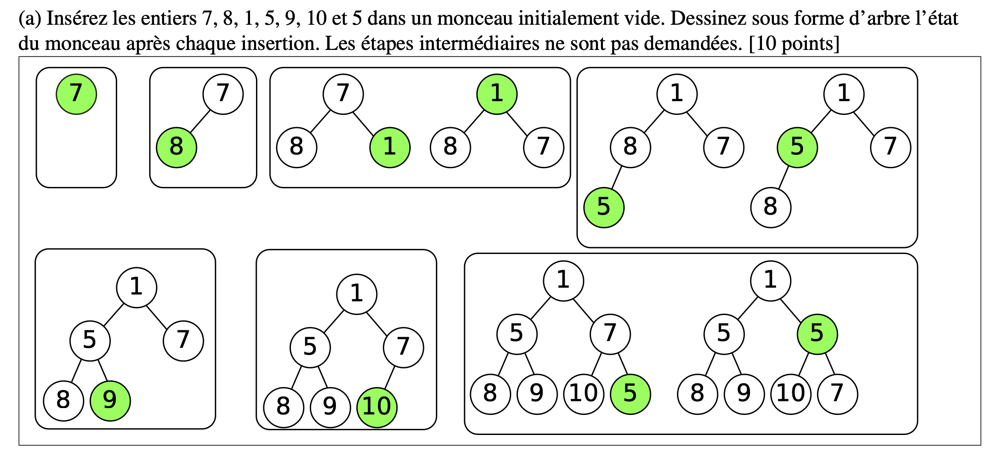

Monceau (Heap)
==============

<!-- START doctoc generated TOC please keep comment here to allow auto update -->
<!-- DON'T EDIT THIS SECTION, INSTEAD RE-RUN doctoc TO UPDATE -->
**Table of Contents**  *generated with [DocToc](https://github.com/thlorenz/doctoc)*

- [Monceau (Heap)](#monceau-heap)
- [Monceau (Heap)](#monceau-heap-1)
  - [Définition](#définition)
  - [Notation](#notation)
  - [Complexité temporelle](#complexité-temporelle)
  - [Insertion](#insertion)
    - [Exemple Insertion](#exemple-insertion)
- [Suppresion de l'élément prioritaire](#suppresion-de-lélément-prioritaire)
- [Priorité](#priorité)

<!-- END doctoc generated TOC please keep comment here to allow auto update -->

# Monceau (Heap)
## Définition  

Un monceau (tas) est un arbre binaire complet dans
lequel il existe un ordre entre un nœud et ses
descendants

- On parle d’un Max-heap si tout nœud a une valeur
plus grande ou égale à celles de ses deux fils.
- On parle d’un Min-heap si tout nœud a une valeur
plus petite ou égale à celles de ses deux fils

## Notation
| Étiquette | Signification |
| :---: | :---: |
| G | un Graphes |
| V | un ensemble de sommets (vertices, noeuds) |
| E | une collection d'arêtes (edges, arcs) |

## Complexité temporelle 

| Algorithme | Complexité (pire cas) |
| :---: | :---: |
| l’insertion d’un élément| O(logn) |
| la suppression de l’élément le plus petit (ou plus grand) | O(1) |
| l’accès à l’élément le plus petit (ou plus grand)  | O(n) |

## Insertion

1. Inserer l'élément à la fin de la liste (*O(1)*). Ceci est analogue à 
   insérer le nouveau noeud dans la prochaine place disponible (en allant de
   gauche à droite de façon complète) dans l'arbre.
2. Tant que le nouveau élement est plus petit que son parent (et l'élément
   n'est pas à la racine, bien sûr): l'echanger de place avec son parent.

### Exemple Insertion 

# Suppresion de l'élément prioritaire

1. On mémorise le premier élément (indice 0)
2. On transfert le dernier élément à la place du premier (bye bye premier
   élément)
3. Tant que cet élément est plus grand que ses deux enfants, on l'échange de
   place avec le plus petit des deux enfants 

# Priorité

Le monceau est utilisé pour implémenter la **liste de priorité**, qui place
l'élément le plus prioritaire au début. Le concept de priorité permet de 
pouvoir definir une base autre que < ou > pour comparer les éléments.
